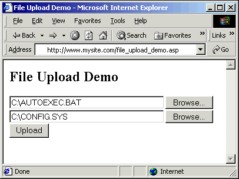



## File Upload Component for ASP Apps \(includes demo\)

### Description

Want anyone with a common web browser to be able to upload files to your ASP application? Here's a great little component to help you do it.

This component builds on the standard mechanism web browsers provide for uploading files. Since IIS doesn't provide any simple built-in way to deal with this, this component fills the void. Here's how simple your ASP code can be:

&nbsp;&nbsp;&nbsp; Set Upload = Server.CreateObject("Carnicelli.FileUpload")

 &nbsp;&nbsp;&nbsp; Upload.Save "C:\Temp"

 &nbsp;&nbsp;&nbsp; Response.Write "&lt;LI&gt;" & Upload.Form("Email")

 &nbsp;&nbsp;&nbsp; Response.Write "&lt;LI&gt;" & Upload.File(1).FileName

I crammed a number of useful features for manipulating the resulting files, generating unique file names, and more.

This code teaches many programming lessons. It demonstrates MIME processing, array and string manipulation (includes powerful array and string manipulation libraries), generating unique file names, real-time stream processing, interfacing with IIS' built-in objects (e.g., "Request" and "Session") without help from the ASP code, binary file manipulation, processing with a finite-state-machine model, MTX (Transaction Server) components, and more.

Please comment on this code and vote for my hard work if you like this code.

----

Now there's a commercial version of this product available. It's been rebuilt from the ground up, correcting all the issues you've reported here and including new features. And it comes complete with extensive documentation and good service.

Check it out!

 
### More Info
 

             |
---                |---
**Submitted On**   |2000-12-08 23:39:30
**By**             |[James Vincent Carnicelli](https://github.com/Planet-Source-Code/PSCIndex/blob/master/ByAuthor/james-vincent-carnicelli.md)
**Level**          |Intermediate
**User Rating**    |5.0 (80 globes from 16 users)
**Compatibility**  |VB 4\.0 \(32\-bit\), VB 5\.0, VB 6\.0, ASP \(Active Server Pages\) 
**Category**       |[Custom Controls/ Forms/  Menus](https://github.com/Planet-Source-Code/PSCIndex/blob/master/ByCategory/custom-controls-forms-menus__1-4.md)
**World**          |[Visual Basic](https://github.com/Planet-Source-Code/PSCIndex/blob/master/ByWorld/visual-basic.md)
**Archive File**   |[CODE\_UPLOAD124961292000\.zip](https://github.com/Planet-Source-Code/james-vincent-carnicelli-file-upload-component-for-asp-apps-includes-demo__1-12635/archive/master.zip)

